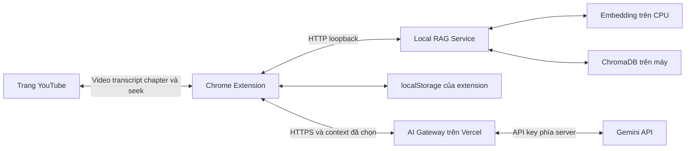
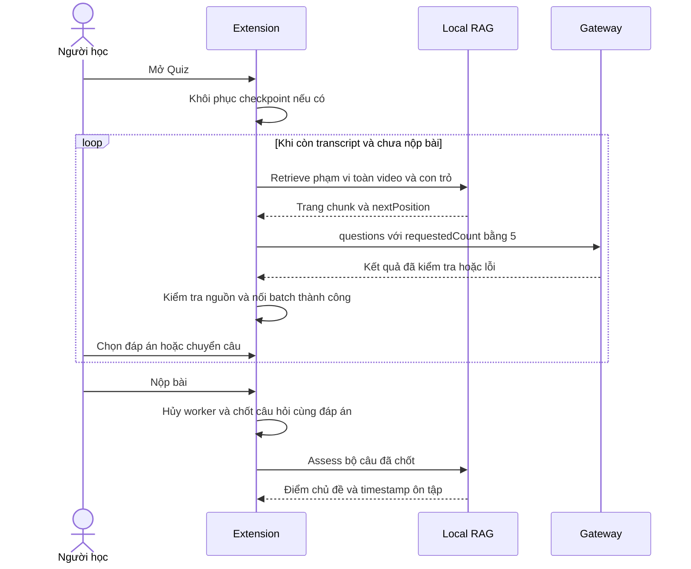
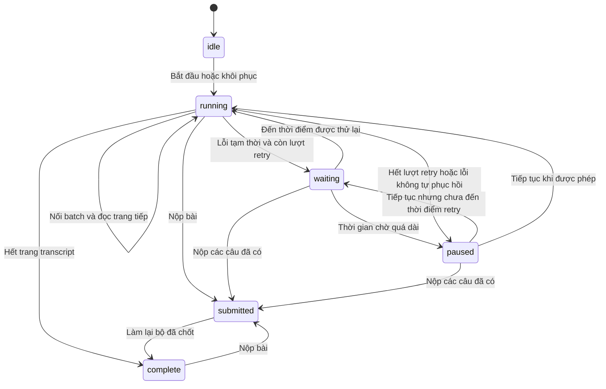

# Đặc tả thiết kế phần mềm YouTube AI Learning Assistant

## Kiểm soát tài liệu

| Thuộc tính | Giá trị |
|---|---|
| Mã tài liệu | YALA-SDS-002 |
| Phiên bản | 2.0 |
| Ngày cập nhật | 07/10/2026 |
| Mốc mã nguồn đối chiếu | `edaab7d` trên nhánh `qanh` |
| Trạng thái | Đặc tả kỹ thuật cập nhật; chưa ghi nhận ký duyệt baseline của nhóm |
| Phạm vi | Chrome Extension, Local RAG Service, ChromaDB cục bộ và AI Gateway trên Vercel |
| Tài liệu tiền nhiệm | `SDS_YouTube_AI_Learning_Assistant_V1.docx`, phiên bản nội dung 1.1, ngày 05/09/2026 |

YouTube AI Learning Assistant hỗ trợ người dùng học ngay trên video YouTube đang xem bằng quiz, flashcard, hỏi đáp có dẫn nguồn và đánh giá bài làm. Phiên bản này mô tả thiết kế đã triển khai sau khi bỏ Google OAuth, bổ sung AI Gateway và chuyển quiz sang sinh tuần tự từng đợt trong lúc người dùng làm bài.

Tài liệu dùng cho phát triển, bảo trì và kiểm thử. Các chức năng trong mục 1.2 thuộc phạm vi hiện tại; các giới hạn ở mục 13 không được hiểu là tính năng đã hoàn thành. Bản V1 được giữ nguyên để tra cứu lịch sử. Số phiên bản tài liệu không phải số phiên bản extension hoặc phiên bản pipeline RAG.

| Phiên bản | Thay đổi chính |
|---|---|
| 1.1 | Thiết kế Extension và Local RAG Service; Google OAuth và gọi Gemini trực tiếp; dữ liệu bài làm trong phiên |
| 2.0 | Bỏ OAuth; bổ sung gateway; transcript có phương án dự phòng; quiz toàn video sinh từng đợt; flashcard theo phần; lưu tiến độ cục bộ; cập nhật retrieval, API, bảo mật và kiểm thử |

## Mục lục

1. [Mục đích và phạm vi](#1-mục-đích-và-phạm-vi)
2. [Đối chiếu thay đổi với SDS V1](#2-đối-chiếu-thay-đổi-với-sds-v1)
3. [Kiến trúc tổng thể](#3-kiến-trúc-tổng-thể)
4. [Thiết kế các thành phần](#4-thiết-kế-các-thành-phần)
5. [Thiết kế hành vi khi chạy](#5-thiết-kế-hành-vi-khi-chạy)
6. [Thiết kế dữ liệu và lưu trữ](#6-thiết-kế-dữ-liệu-và-lưu-trữ)
7. [Thiết kế giao diện và API](#7-thiết-kế-giao-diện-và-api)
8. [Thiết kế RAG và sinh nội dung](#8-thiết-kế-rag-và-sinh-nội-dung)
9. [Trạng thái và xử lý lỗi](#9-trạng-thái-và-xử-lý-lỗi)
10. [Bảo mật và riêng tư](#10-bảo-mật-và-riêng-tư)
11. [Cài đặt và vận hành](#11-cài-đặt-và-vận-hành)
12. [Kiểm thử và nghiệm thu](#12-kiểm-thử-và-nghiệm-thu)
13. [Giới hạn và quyết định còn mở](#13-giới-hạn-và-quyết-định-còn-mở)
14. [Trách nhiệm và quản lý thay đổi](#14-trách-nhiệm-và-quản-lý-thay-đổi)
15. [Nguồn đối chiếu](#15-nguồn-đối-chiếu)

## 1 Mục đích và phạm vi

### 1.1 Mục đích thiết kế

Hệ thống biến transcript của video hiện tại thành nội dung học có thể thực hành và kiểm chứng bằng timestamp. YouTube tiếp tục là nơi xem video. Extension là giao diện học; Local RAG Service xử lý nội dung trên máy; gateway chuyển yêu cầu sinh nội dung đến Gemini mà không đưa API key vào trình duyệt.

Thiết kế giữ chỉ mục và dữ liệu tiến độ tại máy người dùng. Tuy nhiên, việc sinh nội dung cần Internet: các đoạn transcript được chọn và câu hỏi cần thiết đi qua gateway đến Gemini. Hệ thống không phải một sản phẩm AI chạy hoàn toàn ngoại tuyến.

### 1.2 Chức năng hiện tại

| Mã | Chức năng | Hành vi chính |
|---|---|---|
| FR01 | Nhận diện video | Đọc Video ID, tiêu đề, kênh, thời lượng và thời gian đang phát; phát hiện chuyển video trên YouTube SPA |
| FR02 | Transcript và chapter | Lấy transcript có timestamp; đọc chapter YouTube nếu có; thử bảng bản chép lời khi đường lấy caption không dùng được |
| FR03 | Chuẩn bị RAG | Kiểm tra service, lập hoặc tái sử dụng index của đúng video, theo dõi trạng thái index |
| FR04 | Quiz toàn video | Đọc transcript tuần tự; mỗi request yêu cầu tối đa 5 câu; hiển thị và nối các batch đã kiểm tra |
| FR05 | Làm bài liên tục | Chọn đáp án, chuyển câu trước/sau; giữ câu đang xem và đáp án khi batch mới đến hoặc chuyển tab chức năng |
| FR06 | Chấm và làm lại | Nộp bộ câu hiện có; dừng sinh tiếp; chấm cục bộ; làm lại chính bộ câu đã chốt |
| FR07 | Flashcard theo phần | Chọn chapter/phần, tạo thẻ, lật thẻ, chuyển thẻ, tự đánh giá đã nhớ/chưa nhớ và xem đoạn nguồn |
| FR08 | Ask AI | Hỏi về video, xin gợi ý cho câu quiz hoặc hỏi về thẻ; trả lời từ context RAG và kèm nguồn |
| FR09 | Điều hướng timestamp | Click nguồn hoặc mốc chapter để chuyển player tới đoạn tương ứng |
| FR10 | Cache cục bộ | Tái sử dụng nội dung đã tạo; lưu checkpoint quiz gồm câu hỏi, đáp án và con trỏ sinh tiếp |
| FR11 | Phục hồi khi lỗi | Hiển thị lỗi, giữ dữ liệu quiz đã có, retry có giới hạn và tuân theo thời điểm provider cho phép |

### 1.3 Chức năng đã bỏ

**Google OAuth đã được loại bỏ khỏi runtime của extension.** Không còn luồng đăng nhập/đăng xuất Google, lấy hoặc làm mới OAuth token, kiểm tra quyền OAuth, xử lý token hết hạn, cấu hình OAuth client hay quyền `chrome.identity` phục vụ Gemini.

Extension không gọi Gemini trực tiếp bằng OAuth hoặc API key. Người vận hành cấu hình API key ở gateway; người dùng extension không cần tài khoản ứng dụng hoặc đăng nhập Google để gọi chức năng AI của sản phẩm. Việc đăng nhập YouTube để xem một video có yêu cầu quyền truy cập là việc riêng của YouTube.

### 1.4 Ngoài phạm vi hiện tại

- Tài khoản ứng dụng, MySQL, lịch sử học tập trên server và đồng bộ nhiều thiết bị.
- Tổng hợp kiến thức từ nhiều video, đề xuất video khác hoặc xây dựng lộ trình học.
- Notes, bookmark và màn hình lịch sử học tập như một hệ thống quản lý riêng.
- Sinh phụ đề từ audio bằng speech-to-text khi video không có transcript sử dụng được.
- Gọi AI tích hợp sẵn của YouTube để lấy bản chép lời hoặc trả lời câu hỏi.
- Bảo đảm xử lý mọi video, mọi giao diện YouTube hoặc mọi tình trạng quota Google.
- Sinh chapter ngữ nghĩa, summary và concept tự động như các chức năng độc lập.

Hai bản SDS mang tên Learning Companion trong cùng thư mục là tài liệu lịch sử có phạm vi rộng hơn, gồm MySQL, notes, bookmark và job nghiệp vụ. Chúng không được gộp mặc nhiên vào phạm vi V2 này. Việc không dùng MySQL đã có trong SDS V1, không phải thay đổi mới của V2.

## 2 Đối chiếu thay đổi với SDS V1

| Mã | Thiết kế trong V1 | Thiết kế V2 | Phần bị ảnh hưởng |
|---|---|---|---|
| CH01 | Google OAuth và token trong extension | Loại bỏ hoàn toàn OAuth; không có màn hình đăng nhập Google của sản phẩm | Khởi động, manifest, trạng thái, bảo mật, test |
| CH02 | Extension gọi Gemini trực tiếp | Extension gọi gateway Vercel; gateway giữ key và gọi provider | Kiến trúc, network, API, triển khai |
| CH03 | Không cần hạ tầng cloud của dự án | Thêm Vercel Functions; RAG và ChromaDB vẫn ở máy người dùng | Topology, vận hành, quota |
| CH04 | Tạo quiz rồi mới làm bài; chưa quy định batch | Quiz toàn video, sinh từng đợt tối đa 5 câu và nối vào bộ đang làm | UI, session, concurrency |
| CH05 | Chọn chunk phù hợp bằng retrieval chung | Quiz/flashcard có phân trang theo phạm vi thời gian; Ask AI dùng tìm kiếm ngữ nghĩa | Retriever, DTO, context |
| CH06 | Quiz và đáp án chỉ trong phiên | Lưu checkpoint quiz trong localStorage để khôi phục | Dữ liệu, riêng tư, xóa cache |
| CH07 | Flashcard chưa có cơ chế phân phần cụ thể | Chapter/phần học, cache theo phạm vi và nhiều request khi cần | Flashcard UI, cache |
| CH08 | Hỏi đáp tự do không phải chức năng bắt buộc | Có Ask AI trên trang chính và trong màn hình học | Phạm vi, UI, task answers |
| CH09 | Lấy transcript ở mức tổng quát | Caption trước, bảng bản chép lời làm phương án dự phòng; hỗ trợ selector cũ/mới | YouTube Adapter, regression |
| CH10 | Gemini tạo nhận xét sau chấm | Luồng đánh giá hiện tại dùng kết quả tính toán và lý do ôn tập từ local service | Assessment, mô tả AI |
| CH11 | Retry lỗi quota được nêu tổng quát | Scheduler quiz giữ Retry-After, retry giới hạn và không hiển thị đếm ngược cố định | Gateway client, quiz state |
| CH12 | Chuyển video xóa quiz trong phiên | Hủy worker và chuyển session; checkpoint của video cũ có thể còn để khôi phục | Session, lưu trữ |

V1 không quy định giới hạn sáu câu cho một video. Việc bỏ mức sáu câu của giao diện trước là thay đổi triển khai. Quy tắc năm câu ở V2 là trần mỗi đợt sinh, không phải tổng số câu của video và không bắt model tạo câu thiếu căn cứ.

## 3 Kiến trúc tổng thể



Các request cloud phát sinh từ extension tới gateway. Local RAG Service không gọi gateway hay Gemini; nó trả context về extension. Gateway không truy cập trực tiếp ChromaDB và không cần truy cập trang YouTube của người dùng.

| Thành phần | Trách nhiệm | Ranh giới |
|---|---|---|
| Content script và YouTube Adapter | Đọc trang, transcript, chapter, thời gian và điều khiển player | Không giữ credential Gemini |
| Sidebar React | Điều phối phiên video, giao diện học, cache, gọi Local API và gateway | Không chạy embedding hoặc truy cập ChromaDB trực tiếp |
| Service worker MV3 | Khởi tạo và điều khiển side panel theo thao tác người dùng | Không còn module OAuth |
| Local RAG Service | Chuẩn hóa, chunking, embedding, index, retrieval và assessment | Bind loopback; không quản lý tài khoản hoặc API key |
| ChromaDB PersistentClient | Chunk, vector, metadata và cache index theo video | Không lưu đáp án và điểm học tập |
| AI Gateway | Validation, prompt/schema, key, cấu hình model, timeout và provider errors | Không là database nghiệp vụ hoặc kho lịch sử học tập |
| Gemini | Sinh quiz, flashcard và câu trả lời từ context được cung cấp | Không quyết định điểm số quiz |

Gateway có hỗ trợ task `feedback` ở mức API. Luồng Assessment UI hiện tại không gọi task này; không được mô tả nó là nhận xét AI đang chạy sau mỗi lần nộp bài.

## 4 Thiết kế các thành phần

### 4.1 Chrome Extension

Extension dùng Manifest V3, React và TypeScript. Giao diện gồm Trang chính, Quiz, Flashcard và Đánh giá. Trang chính hiển thị video, trạng thái chuẩn bị RAG, nút bắt đầu học, chapter YouTube nếu có và Ask AI.

YouTube Adapter cô lập phụ thuộc DOM. Sidebar trao đổi với content script bằng message có Video ID. Câu trả lời và timestamp từ video cũ không được đưa vào session video mới.

`ProgressiveQuizSession` được App sở hữu theo video, thời lượng và ngôn ngữ, thay vì gắn vòng đời vào riêng QuizView. Vì vậy rời tab Quiz sang tab khác không tự sinh lại bộ quiz hoặc mất đáp án. Worker quiz có thể tiếp tục khi sidebar còn mở; đây không phải background job bền vững chạy sau khi đóng sidebar.

| Module | Đường dẫn chính |
|---|---|
| YouTube và transcript | `extension/src/content/`, `extension/src/integrations/youtube/` |
| Điều phối video và RAG | `extension/src/sidebar/hooks/useYouTubeContext.ts`, `useVideoRagSession.ts` |
| Sinh quiz tuần tự | `extension/src/integrations/learning/progressiveQuiz.ts` |
| Chia phần học và cache thẻ | `extension/src/integrations/learning/sections.ts`, `cache.ts` |
| Pipeline flashcard và hỏi đáp | `extension/src/integrations/learning/pipeline.ts` |
| HTTP gateway và local service | `extension/src/integrations/ai-gateway/`, `local-service/` |
| Kiểm tra và ánh xạ nội dung AI | `extension/src/ai-content/` |

### 4.2 Local RAG Service

FastAPI phục vụ JSON tại `http://127.0.0.1:8765/api/v1`. Lớp transport kiểm tra kiểu dữ liệu, Video ID, origin, body và timeout. Facade điều phối tác vụ RAG, tránh chạy đồng thời các thao tác model/store không phù hợp. Health phản ánh cả embedding và vector store; mở cổng thành công chưa đồng nghĩa service sẵn sàng.

Transcript được chuẩn hóa rồi gộp segment ngắn, chia chunk có overlap, gắn timestamp và embedding. Fingerprint index xét transcript đã chuẩn hóa, thời lượng, ngôn ngữ, model và pipeline. Không chỉ kiểm tra Video ID để quyết định tái sử dụng index.

### 4.3 ChromaDB và embedding

ChromaDB dùng PersistentClient và không tự tạo embedding. Vector do Sentence Transformers chạy cục bộ cung cấp. Model mặc định trong code là `sentence-transformers/paraphrase-multilingual-MiniLM-L12-v2`, có revision được cố định trong cấu hình; thiết bị mặc định là CPU, batch embedding mặc định 16.

Collection phụ thuộc model, pipeline và chiều vector. Chỉ mục được công bố sau khi ghi hoàn tất; metadata quản lý trạng thái index và fingerprint nằm cùng cache. Khi đổi model hoặc quy tắc chunking, phải dùng phiên bản index tương thích, không trộn vector khác cấu hình.

### 4.4 AI Gateway

Gateway Node.js/TypeScript chạy bằng Vercel Functions. Nó nhận dữ liệu nghiệp vụ, tự dựng system instruction và structured output schema, rồi gọi Gemini qua provider adapter. Tại mốc mã nguồn này, adapter sử dụng endpoint Interactions API và đặt `background: false`, `store: false`, `stream: false`.

Tên model do `GEMINI_MODEL` phía server quyết định. Đây là cấu hình triển khai, không phải dữ liệu được extension gửi. Thay model không yêu cầu đưa key hoặc provider SDK vào extension. Cờ `store: false` là tham số request; không được suy rộng thành cam kết về mọi chính sách lưu trữ của nhà cung cấp.

## 5 Thiết kế hành vi khi chạy

### 5.1 Khởi động và chuẩn bị video

1. Người dùng mở side panel tại trang video YouTube.
2. Extension đọc video và kiểm tra Local RAG Service. Không có bước kiểm tra OAuth hoặc đăng nhập.
3. Content script lấy transcript cùng chapter nếu có. Caption lỗi hoặc không có track sử dụng được thì thử bảng bản chép lời của YouTube.
4. Extension gửi video và transcript tới API index. Service trả cache hit hoặc trạng thái đang lập chỉ mục.
5. Extension theo dõi index đến khi ready; khi đó cho phép quiz, flashcard và Ask AI.
6. Nếu video đổi trong quá trình xử lý, hủy yêu cầu phía client và loại kết quả không còn thuộc video hiện tại.

### 5.2 Thu thập transcript

Nguồn chính là caption track trong dữ liệu player. Khi không tải được dữ liệu player, không tìm thấy track hoặc tải caption thất bại, extension thử đọc transcript do YouTube hiển thị. Bộ đọc DOM thử selector renderer cũ trước; nếu chưa có hàng hợp lệ thì thử `transcript-segment-view-model`.

Các hàng đọc được phải có văn bản và timestamp hợp lệ, được chuẩn hóa, bỏ hàng trùng và sắp theo thời gian. Phương án UI có thể mở phần mô tả/bảng transcript và cuộn để thu thập nội dung. Kết quả vẫn phụ thuộc YouTube có hiển thị và tải đủ dữ liệu trong thời gian chờ cho phép.

Nếu không có transcript dùng được, pipeline dừng với trạng thái phù hợp. Hệ thống không tự suy diễn transcript từ tiêu đề, thumbnail hoặc gọi AI của YouTube để thay thế nguồn.

### 5.3 Quiz toàn video theo từng đợt



Quy tắc thực thi:

- Phạm vi quiz là từ đầu đến hết video, không có bộ chọn chapter và không chia thành lượt bắt buộc sáu câu.
- Mỗi trang retrieval yêu cầu tối đa 6 chunk, đồng thời chịu ngân sách context. Mỗi request AI yêu cầu tối đa 5 câu cho trang đó; đây không phải streaming từng token hoặc từng câu từ provider.
- Khi một batch hợp lệ hoàn thành, UI hiện ngay các câu mới. Không đợi tạo xong toàn video mới cho làm bài.
- Mỗi session chỉ có một worker sinh quiz. Sau thành công, tiếp tục trang kế tiếp mà không thêm khoảng nghỉ cố định.
- Con trỏ chỉ tiến khi batch đã xử lý thành công. Đoạn không có ý kiến thức có thể trả `insufficient_context` và mảng rỗng, sau đó vẫn đọc phần tiếp theo.
- Câu trùng văn bản sau chuẩn hóa được loại bỏ. ID của câu đã có không đổi; batch mới chỉ nối cuối bộ câu.
- Append không reset câu đang xem, đáp án, component câu hỏi hoặc hội thoại gắn với câu đó. Chuyển câu vẫn là thao tác chủ động của người dùng.
- Lỗi ở batch sau không loại bỏ batch trước. Retry dùng con trỏ của trang chưa hoàn thành.
- Mức bảo vệ hiện tại là 2.000 câu trong bộ quiz. Nếu thêm batch sẽ vượt trần, worker tạm dừng với thông báo; không tuyên bố đã bao phủ hết video.

Việc đi qua tất cả các trang transcript không bảo đảm mọi ý nghĩa đều có một câu hỏi. Model có thể trả ít câu hơn, bỏ đoạn không có kiến thức hoặc diễn đạt các ý chưa đủ đa dạng. Chất lượng bao phủ cần đánh giá riêng.

### 5.4 Nộp bài và làm lại

Người dùng có thể nộp khi đã có câu hỏi, kể cả lúc đang tạo tiếp. Nút nộp thông báo rằng thao tác này sẽ dừng bổ sung câu. Session hủy worker và chốt mảng câu hỏi/đáp án trước khi gửi request chấm. Câu chưa chọn được gửi bằng `selectedAnswer: null` và tính là chưa trả lời đúng.

Kết quả AI đến sau thời điểm chốt không được nối vào bài. Nếu chấm lỗi, giữ bộ đã chốt và cho thử chấm lại, không sinh lại câu hỏi. Làm lại từ màn hình đánh giá xóa đáp án của lần làm trước nhưng tái sử dụng chính bộ câu đã chốt, không phát sinh request AI mới. Nếu người dùng nộp sớm, làm lại không tự khôi phục sinh các phần còn lại của video.

### 5.5 Flashcard theo chapter hoặc phần học

Flashcard có bộ chọn phần riêng. Ưu tiên chapter thực tế của YouTube; chapter dài được chia tại biên transcript với mục tiêu khoảng 300 giây hoặc 8.000 ký tự. Khi thiếu chapter, phần học dùng nhãn trung tính như Phần 1, Phần 2; đây không phải chapter do AI hiểu nội dung và đặt tên.

Mỗi phần được đọc qua các trang retrieval, tối đa 12 chunk mỗi trang và chịu ngân sách context; mỗi request yêu cầu tối đa 10 thẻ. Pipeline gộp và bỏ trùng trước khi hiển thị bộ thẻ của phần. Flashcard chưa dùng cơ chế append trực tiếp trong lúc học như quiz.

Người dùng lật mặt trước/sau, chuyển thẻ, chọn đã nhớ/chưa nhớ, hỏi AI và mở nguồn timestamp. Nội dung thẻ được cache theo video/phần. Trạng thái tự đánh giá, thẻ đang xem và mặt đang lật là state của view, không có cam kết khôi phục như checkpoint quiz. Nút `+ Thêm` hiện gọi tạo lại bộ thẻ của phần, không phải nối thẻ vào bộ cũ.

### 5.6 Ask AI

Trang chính cho hỏi về video; quiz cho xin gợi ý; flashcard cho hỏi về nội dung thẻ. Extension gửi câu hỏi đến retrieval với `purpose: review`, sau đó gửi context và câu hỏi tới task `answers` của gateway.

Câu trả lời phải có chunk nguồn và trích đoạn bằng chứng hợp lệ. Timestamp được ánh xạ từ chunk gốc, không lấy timestamp do AI tự bịa. Gợi ý quiz có chỉ dẫn tránh tiết lộ đáp án, nhưng đây là chỉ dẫn cho model, không phải bảo đảm tuyệt đối về nội dung trả lời.

### 5.7 Chuyển tab và chuyển video

Chuyển giữa Trang chính, Quiz, Flashcard và Đánh giá trong cùng video không tạo session quiz mới. Chuyển Video ID hủy worker quiz cũ, đưa giao diện về video mới và ngăn kết quả cũ xuất hiện ở đó. Checkpoint localStorage và index ChromaDB của video trước không tự bị xóa chỉ vì chuyển video.

Đóng sidebar có thể chấm dứt worker phía client. Khi mở lại, hệ thống có thể khôi phục checkpoint và tiếp tục trang chưa hoàn thành sau khi RAG sẵn sàng. Hủy request ở trình duyệt không bảo đảm provider chưa xử lý hoặc chưa tính quota cho request đã nhận.

## 6 Thiết kế dữ liệu và lưu trữ

### 6.1 Các lớp dữ liệu

| Dữ liệu | Nơi giữ | Vòng đời hiện tại |
|---|---|---|
| Transcript và chapter đã đọc | Cache bộ nhớ của content script/session | Có thể mất khi reload trang hoặc kết thúc context trình duyệt |
| Chunk, vector, timestamp, index metadata | `local-rag-service/data/chroma` | Bền vững qua restart; xóa bằng API hoặc công cụ cục bộ |
| Model embedding | `local-rag-service/data/models` | File model trên máy; tách khỏi cache index |
| Câu quiz, đáp án, câu đang xem, cursor, trạng thái | localStorage thuộc origin extension | Có thể khôi phục qua reload; không có TTL tự động trong code hiện tại |
| Bộ flashcard | localStorage và cache bộ nhớ | Theo video/phần; có thể dùng lại thay vì gọi AI |
| Điểm và báo cáo Assessment UI | State của App trong phiên | Không ghi vào ChromaDB hoặc kho lịch sử trên server |
| Hội thoại Ask AI và tự đánh giá thẻ | State của component | Không đồng bộ hoặc lưu như lịch sử lâu dài |
| Request ID, task, mã lỗi, thời gian xử lý | Log vận hành đã giới hạn trường | Theo cấu hình môi trường và nền tảng triển khai |

### 6.2 Cấu trúc nội dung học

`Question` gồm `questionId`, `question`, `options`, `correctAnswer`, `explanation`, `topic`, `sourceTimestamp`. `correctAnswer` là chỉ số bắt đầu từ 0; câu hỏi do gateway sinh có đúng bốn phương án. `sourceTimestamp` gồm `chunkId`, `startSec`, `endSec`.

Đáp án quiz được tra bằng `questionId`, không dùng vị trí mảng làm khóa đáp án. Nhờ đó nối batch không đổi kết quả của các câu cũ. Bộ câu gửi chấm là bản đã chốt tại thời điểm nộp, không phải danh sách có thể tiếp tục tăng.

Flashcard có `flashcardId`, `front`, `back`, `topic` và timestamp nguồn. `LearningSection` có `id`, `title`, `startSec`, `endSec`, `source`, phân biệt chapter YouTube và phần chia từ transcript.

### 6.3 Checkpoint quiz

Khóa hiện tại có dạng `yala:quiz-progress:v1:<videoId>:<durationSec>:<language>`. Nội dung lưu gồm câu hỏi, đáp án, `currentIndex`, `status`, `message`, `cursor`, `completed` và `notBefore` để không bỏ qua thời điểm retry sau reload.

Đọc cache phải kiểm tra cấu trúc và chỉ nhận đáp án thuộc câu hợp lệ. Khi localStorage đầy hoặc bị vô hiệu hóa, việc học vẫn dùng state trong bộ nhớ; không thể bảo đảm khôi phục sau reload trong trường hợp này.

Khóa checkpoint chưa chứa fingerprint transcript hoặc pipeline version. Vì vậy thay đổi nguồn phụ đề/index có thể làm cache quiz không còn khớp nguồn để chấm. Đây là giới hạn hiện tại, cần giải quyết trước khi khẳng định cache tự vô hiệu hóa theo mọi thay đổi dữ liệu.

### 6.4 Xóa dữ liệu

API DELETE cache và script xóa dữ liệu cục bộ xử lý cache index của Local RAG Service; chúng không đồng thời xóa localStorage của extension. Hiện chưa có thao tác UI thống nhất để xóa toàn bộ checkpoint quiz, bộ thẻ và index video.

Xóa dữ liệu extension không được mô tả là tự xóa thư mục ChromaDB trên máy. Ngược lại, xóa ChromaDB không được mô tả là xóa mọi đáp án đã lưu. Chính sách TTL, giới hạn tổng cache và thao tác xóa đồng bộ là quyết định còn mở.

## 7 Thiết kế giao diện và API

### 7.1 Quy ước chung

Local API dùng tiền tố `/api/v1`, JSON camelCase và HTTP loopback. Gateway dùng HTTPS trong production. Request liên quan video phải nhất quán Video ID giữa path, payload và các chunk. Không gửi credential Gemini tới local service hoặc trong payload gateway.

Extension gọi API với `credentials: omit`. Gateway chỉ nhận các trường nghiệp vụ cho task tương ứng; không nhận model, API key, system prompt hoặc response schema do client tùy ý cung cấp.

### 7.2 Local REST API

| Method | Endpoint | Đầu vào và kết quả chính |
|---|---|---|
| GET | `/api/v1/health` | Trả status, serviceVersion, pipelineVersion, embeddingModelReady, vectorStoreReady; 503 nếu chưa sẵn sàng |
| POST | `/api/v1/videos/{videoId}/index` | Nhận video và transcriptSegments; trả 200 khi cache hit hoặc 202 khi indexing |
| GET | `/api/v1/videos/{videoId}/index-status` | Trả not_indexed, indexing, ready hoặc failed, kèm chunkCount/pipelineVersion |
| POST | `/api/v1/videos/{videoId}/retrieve` | Nhận query, purpose, maxResults và tùy chọn phạm vi/con trỏ; trả chunks và nextPosition khi còn trang |
| POST | `/api/v1/videos/{videoId}/assessments/quiz` | Nhận questions và userAnswers; trả điểm, từng kết quả, chủ đề và timestamp ôn tập |
| DELETE | `/api/v1/videos/{videoId}/cache` | Xóa index đúng video; trả deleted và deletedChunkCount |

`IndexRequest.video` gồm `videoId`, `title`, `durationSec`, `language`. Mỗi transcript segment gồm `text`, `startSec`, `endSec`, `position`. DTO giới hạn tối đa 20.000 segment; toàn request vẫn chịu giới hạn body.

`RetrieveRequest` có cấu trúc:

```json
{
  "query": "Nội dung toàn bộ video",
  "purpose": "quiz",
  "maxResults": 6,
  "startSec": 0,
  "endSec": 900,
  "afterPosition": 5
}
```

Đây là ví dụ trang kế tiếp cho video dài 900 giây. Trang đầu bỏ `afterPosition`. `startSec` và `endSec` phải đi cùng nhau, `startSec < endSec`; `afterPosition` chỉ dùng khi có phạm vi. `purpose: review` không nhận phạm vi này. Chunk được chọn theo giao với phạm vi thời gian, giữ nguyên timestamp nguồn, không cắt lại timestamp cho vừa chapter.

Response retrieve gồm `videoId`, `purpose`, `chunks`; mỗi chunk có `chunkId`, `videoId`, `text`, `startSec`, `endSec`, `score`, `position`. Nếu còn dữ liệu, `nextPosition` là position của chunk cuối trang. Không có con trỏ tiếp nghĩa là đã hết trang. Context rỗng có thể kèm `reason: NO_RELEVANT_CONTEXT`.

`AssessmentRequest` có `quizId` tùy chọn, `questions` và `userAnswers`. Mỗi đáp án có `questionId`, `selectedAnswer` là chỉ số phương án hoặc null. Tối đa 2.000 câu và 2.000 đáp án; giới hạn body 2 MiB và timeout vẫn áp dụng, nên không bảo đảm mọi bài đủ 2.000 câu đều vừa request.

`AssessmentResponse` gồm `score`, `correctCount`, `totalCount`, `questionResults`, `strongTopics`, `weakTopics`, `reviewTimestamps`. Mỗi review timestamp có `topic`, `reason`, `chunkId`, `startSec`, `endSec`.

### 7.3 AI Gateway API

| Method | Endpoint | Ý nghĩa |
|---|---|---|
| GET | `/api/health` | Kiểm tra cấu hình/deployment; không gọi Gemini |
| POST | `/api/generate` | Sinh nội dung theo task |
| OPTIONS | Các route được hỗ trợ | Preflight CORS cho origin được phép |

| Task | Trường riêng ngoài language và context | Sử dụng trong UI |
|---|---|---|
| `questions` | `requestedCount` từ 1 đến 10; quiz hiện dùng 5 | Quiz |
| `flashcards` | `requestedCount` từ 1 đến 10; hiện dùng 10 | Flashcard |
| `answers` | `question` | Ask AI trên các màn hình học |
| `feedback` | `assessment` | Có contract/validator; chưa nối vào luồng Assessment UI |

`context` gồm `videoId`, `durationSec`, `chunks`. Với task sinh bộ câu/thẻ, `requestedCount` là tối đa, không phải số lượng bắt buộc. `feedback` có giới hạn riêng tối đa 100 kết quả câu hỏi tại gateway; không đồng nhất với giới hạn 2.000 câu của Local Assessment API.

Response thành công có `data: {status, items}` và `meta: {requestId}`. `status: ok` có các item được kiểm tra; `status: insufficient_context` có mảng rỗng. Item phải có `sourceChunkId`, `evidence`, `topic` và các trường của task. Extension ánh xạ item về câu/thẻ/câu trả lời nội bộ sau validation lần nữa.

Response lỗi có `error: {code, message, retryable, requestId}`. Header `Retry-After` khi có phải được giữ đầy đủ, kể cả giá trị dài hơn một phút. Gateway expose header này cho extension qua CORS.

### 7.4 Chrome message contract

| Message | Hướng | Nội dung |
|---|---|---|
| `YALA_GET_VIDEO_CONTEXT` | Sidebar tới content script | Yêu cầu metadata và thời gian hiện tại |
| `YALA_GET_TRANSCRIPT` | Sidebar tới content script | Video ID cần lấy transcript |
| `YALA_SEEK_TO` | Sidebar tới content script | Video ID và số giây cần seek |
| `YALA_VIDEO_CHANGED` | Content script tới extension | Video ID mới hoặc null |
| `YALA_VIDEO_TIME_CHANGED` | Content script tới extension | Video ID, currentTimeSec và durationSec |

Response có `ok`, loại dữ liệu hoặc mã lỗi. Không có `AUTH_CHECK`, `AUTH_START`, `AUTH_LOGOUT` hay message trao đổi OAuth token trong runtime hiện tại.

### 7.5 Giới hạn kỹ thuật hiện hành

| Giới hạn | Giá trị mặc định hoặc trần trong code |
|---|---|
| Local request body | 2 MiB |
| Local retrieval maxResults | 1 đến 20 |
| Context RAG đã serialize | 6.000 byte UTF-8 |
| Chunking | Mục tiêu tối đa 64 token, overlap 8 token |
| Gateway request body | 64 KiB; gateway client của extension kiểm tra sớm ở 64.000 byte |
| Tổng transcript text trong gateway request | 20.000 byte UTF-8 |
| Chunk trong gateway request | 1 đến 12 |
| Câu hỏi Ask AI | Tối đa 2.000 ký tự |
| Provider response | 512 KiB |
| Quiz batch đang dùng | Tối đa 5 câu |
| Flashcard batch đang dùng | Tối đa 10 thẻ |
| Provider deadline mặc định | 25 giây; cấu hình trong khoảng 1 đến 28 giây |
| Gateway client deadline cho mỗi request học | 35 giây |

Ngân sách output do gateway chọn: questions là `max(3072, requestedCount * 512 + 512)`, flashcards là `max(2048, requestedCount * 320 + 512)`, answers là 3.072 token, feedback là 2.048 token. Đây là tham số request, không bảo đảm model trả đủ số item hoặc luôn thành công trong thời gian đó.

## 8 Thiết kế RAG và sinh nội dung

### 8.1 Pipeline lập chỉ mục

Transcript có timestamp → chuẩn hóa → gộp segment ngắn → chunk có overlap → embedding cục bộ → ghi ChromaDB và metadata → công bố index ready.

Chunk giữ Video ID, thứ tự và timestamp nguồn. Gộp/chia nội dung không được tạo mốc thời gian ngoài video. Cache index phải tương thích model và pipeline, đồng thời dùng fingerprint nguồn để nhận biết transcript thay đổi khi xử lý yêu cầu index.

### 8.2 Hai cách truy xuất

**Quiz và flashcard theo phạm vi:** lấy các chunk của video, lọc theo phạm vi thời gian và `position > afterPosition`, sắp theo thứ tự nguồn, đóng trang trong giới hạn số chunk và ngân sách context. Không dùng độ tương đồng với tiêu đề để chọn vài đoạn đại diện rồi coi đó là toàn video. Chế độ không gửi phạm vi vẫn có nhánh chọn context tổng quan trong backend, nhưng quiz UI mới dùng phạm vi toàn video và phân trang.

**Ask AI và review:** embedding câu hỏi bằng cùng model; ChromaDB dùng cosine để tìm ứng viên trong đúng video; lọc theo threshold mặc định 0,35, bỏ trùng/chồng lấn, lấy top-k và sắp context theo nguồn. Backend mặc định top-k 5; Ask AI hiện yêu cầu tối đa 6 chunk. Chưa có reranker hoặc bước phân loại câu hỏi tổng quan để tự lấy context toàn video.

### 8.3 Prompt và validation

Gateway giữ system instruction, schema và policy output. Transcript được coi là dữ liệu không tin cậy, không được thay đổi chỉ dẫn hệ thống. Prompt yêu cầu chỉ dùng nguồn đã cấp, bỏ lời chào/quảng cáo/kêu gọi đăng ký và không thêm câu chỉ để đủ số lượng.

Gateway và extension kiểm tra cấu trúc, số item, đáp án, chunk nguồn và evidence. Timestamp cuối cùng được lấy từ chunk gốc. Validation bằng chứng bảo đảm tham chiếu hợp lệ ở mức cấu trúc/văn bản; nó không chứng minh hoàn toàn rằng câu trả lời đúng nghĩa hoặc thực sự liên quan tới câu hỏi người dùng.

### 8.4 Chấm điểm và phân tích chủ đề

Local service kiểm tra ID câu không trùng, đáp án hợp lệ và nguồn thuộc index hiện tại. Điểm bằng số câu đúng chia tổng số câu đã nộp nhân 100. Bỏ trống không được tính đúng. Điểm do code xác định, không do Gemini đánh giá tùy ý.

Các chủ đề được chuẩn hóa nhãn và gom theo topic của câu hỏi. Tỷ lệ đúng từ 0,7 trở lên mặc định được xếp vào strongTopics; còn lại vào weakTopics. Với câu sai/bỏ trống, service giữ nguồn gốc đã xác minh và có thể bổ sung tối đa hai kết quả semantic search liên quan trước khi loại trùng.

Review reason hiện là thông điệp do local service tạo. Đây là đánh giá của bộ quiz vừa nộp, không phải hồ sơ năng lực lâu dài hoặc nhận định bao quát cả video khi người dùng đã nộp sớm.

## 9 Trạng thái và xử lý lỗi

### 9.1 Trạng thái quiz



Worker cũng có thể dừng khi đóng sidebar hoặc chuyển video. Việc hủy không được coi là batch thành công và không làm tiến con trỏ.

### 9.2 Retry và quota

Gateway có retry provider trong deadline theo `GEMINI_MAX_RETRIES`, mặc định 1. HTTP client của extension dùng `maxRetries: 0` cho request học để không tự nhân thêm retry ở tầng transport.

Riêng scheduler quiz xử lý lỗi tạm thời giữa các batch: tối đa hai lần tự thử lại cho batch lỗi sau lần gọi ban đầu. Nếu có `Retry-After`, dùng thời gian đó; nếu không có, backoff tăng dần. Nếu cần chờ trên năm phút hoặc hết lượt tự thử, chuyển sang paused để người dùng tiếp tục sau. Nút tiếp tục và reload không được bỏ qua `notBefore` đã lưu.

UI chỉ báo đang bổ sung, đang chờ hoặc tạm dừng; không đếm ngược hoặc hứa hoàn thành sau một số giây cố định. Chuỗi gọi tuần tự giảm request đồng thời trong một session nhưng không bảo đảm tránh quota chung khi nhiều người dùng, Ask AI hoặc flashcard cùng gọi gateway.

### 9.3 Nhóm lỗi và hành vi

| Tình huống | Phản ứng |
|---|---|
| Local service offline/not ready | Giữ video, hiển thị hướng dẫn và kiểm tra lại; chưa cho sinh nội dung |
| Không có transcript | Dừng pipeline, thông báo; không tạo dữ liệu giả |
| Index hoặc retrieval lỗi | Giữ state an toàn, cho retry phù hợp |
| Gateway thiếu cấu hình | `SERVER_NOT_CONFIGURED`; kiểm tra deployment/env, không yêu cầu người dùng đăng nhập OAuth |
| Origin bị từ chối | Kiểm tra origin extension trong allowlist |
| Provider 429 | Giữ câu và đáp án, tuân thủ Retry-After |
| Provider lỗi tạm thời/timeout | Retry giới hạn hoặc paused; không xóa kết quả tốt |
| AI sai schema/evidence | Không đưa batch sai vào bộ câu đã học |
| Video đổi | Hủy request phía client và loại phản hồi cũ |
| Chấm bài thất bại | Giữ bộ đã chốt, cho thử chấm lại |

Local error envelope là `error: {code, message, retryable, details}`. Mã lỗi HTTP hiện tại cho `VIDEO_ID_MISMATCH`, `TRANSCRIPT_INVALID`, `QUERY_INVALID`, `QUIZ_INVALID` là 400; V1 từng mô tả một số trường hợp bằng 409/422. `INDEX_NOT_FOUND` là 404, body quá lớn là 413, origin bị chặn là 403, timeout là 504 và service chưa ready là 503.

## 10 Bảo mật và riêng tư

API key chỉ nằm ở biến môi trường/secret của gateway. Không dùng tiền tố `VITE_` cho key, không commit `.env`, không gửi key đến Local RAG Service. Manifest và bundle không chứa OAuth client, Google access token hoặc permission `identity` phục vụ Gemini.

Local service chỉ bind `127.0.0.1`; kiểm tra origin extension theo cấu hình và từ chối credential không thuộc contract. Gateway cũng kiểm tra origin, method, schema và kích thước request. Origin/CORS không thay thế xác thực người gọi ngoài trình duyệt.

Code hỗ trợ rate limit dùng Upstash Redis khi cấu hình đủ biến. Không có cấu hình store thì không được tuyên bố gateway đã có rate limit phân tán. Trước khi phát hành rộng cần xác nhận cấu hình rate limit/quota và giới hạn chi phí của deployment thực tế. Chủ gateway chịu quota chung; chuyển từ OAuth sang API key không loại bỏ hạn mức Google.

Log ứng dụng không ghi body transcript, prompt, đáp án, API key hoặc provider error thô. Chỉ ghi các trường vận hành được cho phép như request ID, task, mã lỗi, số lần thử và latency. Chính sách log của nền tảng phải được cấu hình tương ứng.

Checkpoint quiz có chứa đáp án đã chọn và câu hỏi. Đây là dữ liệu học tập được lưu cục bộ, vượt phạm vi “chỉ trong phiên” của V1; cần được mô tả rõ khi cung cấp sản phẩm. Hệ thống chưa lưu điểm và lịch sử học tập tập trung, nhưng không thể tuyên bố hoàn toàn không lưu câu trả lời của người học.

## 11 Cài đặt và vận hành

### 11.1 Thành phần triển khai

Một máy người dùng cần extension đã build, Local RAG Service và model embedding đã chuẩn bị. Gateway được triển khai riêng trên Vercel. Không cần cài MySQL hoặc đăng ký OAuth cho người dùng extension.

Mã nguồn liên quan nằm trong `extension/`, `local-rag-service/`, `gateway/`, `scripts/` và `shared/contracts/`. `extension/dist`, cache/model cục bộ, log, `.env` và thư mục làm việc tạm không thuộc mã nguồn được commit.

### 11.2 Cấu hình

| Thành phần | Biến chính | Ý nghĩa |
|---|---|---|
| Extension | `VITE_YALA_GATEWAY_URL` | URL public được đóng vào bản build |
| Extension | `VITE_YALA_EXTENSION_PUBLIC_KEY` | Public key tùy chọn để ổn định extension ID; không phải provider secret |
| Local service | `YALA_RAG_FACTORY` | `app.retrieval.facade:create_facade` để bật RAG thật |
| Local service | `YALA_ALLOWED_ORIGINS` | Origin extension thực tế được phép gọi |
| Local service | `YALA_PORT`, `YALA_DATA_DIR` | Port mặc định 8765 và thư mục data trong phạm vi dự án |
| RAG | `YALA_EMBEDDING_MODEL`, `YALA_CHUNK_TOKENS`, `YALA_OVERLAP_TOKENS` | Model và cấu hình index |
| RAG | `YALA_TOP_K`, `YALA_SIMILARITY_THRESHOLD`, `YALA_CONTEXT_BUDGET` | Tham số retrieval |
| Gateway | `GEMINI_API_KEY` | Secret bắt buộc phía server |
| Gateway | `ALLOWED_EXTENSION_ORIGINS` | Allowlist bắt buộc của gateway |
| Gateway | `GEMINI_MODEL`, `GEMINI_TIMEOUT_MS`, `GEMINI_MAX_RETRIES` | Provider policy phía server |
| Gateway | `UPSTASH_REDIS_REST_URL`, `UPSTASH_REDIS_REST_TOKEN` | Store rate limit tùy chọn trong code; phải có đủ cặp nếu sử dụng |
| Gateway | `RATE_LIMIT_MAX_REQUESTS`, `RATE_LIMIT_WINDOW_SECONDS` | Mặc định 20 request/60 giây khi bật rate limit |

Model triển khai thực tế lấy từ environment của deployment. Không sao chép tên model quan sát ở một lần chạy thành cam kết bất biến của SDS.

### 11.3 Quy trình chạy và cập nhật

1. Chuẩn bị Python/venv, dependency RAG và tải model theo tài liệu/script cài đặt của repository.
2. Cấu hình factory và origin trước khi start local service. Xác nhận health báo ready cho cả embedding và vector store.
3. Cấu hình gateway secret, model, origin và chính sách quota; deploy gateway; kiểm tra health và một request có kiểm soát.
4. Build extension với URL gateway, load thư mục `extension/dist` trong Chrome, xác nhận ID có trong allowlist của cả hai API.
5. Mở video có transcript, mở sidebar và kiểm tra luồng học.

Ví dụ chạy local service sau khi đã cài dependency và model, tại thư mục gốc repository:

```powershell
$env:YALA_RAG_FACTORY = 'app.retrieval.facade:create_facade'
$env:YALA_ALLOWED_ORIGINS = 'chrome-extension://<extension-id-thuc-te>'
.\local-rag-service\.venv\Scripts\python.exe scripts/local_service.py start
```

Phải thay placeholder bằng ID thực tế. Khi đổi code Python hoặc env, stop/start service để nạp lại. Khi đổi code extension hoặc cấu hình `VITE_`, build lại và Reload extension. Khi đổi code/env gateway, tạo deployment mới. Reload backend cục bộ không thay đổi quota Google hoặc environment của Vercel.

### 11.4 Quan sát vận hành

Theo dõi health local, health gateway, latency retrieval/provider, status HTTP, mã lỗi và request ID. Phân biệt 503 do thiếu cấu hình gateway với 429 do provider giới hạn, thay vì quy tất cả thành “Vercel không phản hồi”. Health gateway thành công chỉ chứng minh cấu hình/deployment đáp ứng kiểm tra health; không chứng minh provider còn quota.

## 12 Kiểm thử và nghiệm thu

### 12.1 Ma trận truy vết

| Yêu cầu | Bằng chứng kiểm thử trong repository | Điều kiện cần kiểm tra |
|---|---|---|
| FR01, FR09 | Test YouTube/message và `App.integration.test.tsx` | Đúng video, seek đúng, không dùng phản hồi của video cũ |
| FR02 | `transcriptDom.test.ts` và test YouTube | Selector cũ/mới, timestamp hợp lệ, nguồn rỗng và thiếu transcript |
| FR03 | `useVideoRagSession.test.tsx`, test RAG/HTTP | Health, index ready/cache hit, không trộn video |
| FR04, FR05 | `progressiveQuiz.test.ts`, `App.test.tsx` | Một worker, append batch, ID ổn định, radio/câu hiện tại được giữ |
| FR06 | Test progressive quiz, App và assessment | Nộp giữa lúc sinh, bỏ phản hồi muộn, điểm theo bộ đã chốt, làm lại không gọi AI |
| FR07 | Test learning sections, pipeline và App | Đúng phạm vi phần học, nhiều trang, cache và UI thẻ |
| FR08 | Test pipeline và ai-content | Retrieval theo câu hỏi, evidence/citation, insufficient_context |
| FR10 | Test progressive quiz và learning cache | Khôi phục checkpoint, retry đúng cursor, giữ đáp án và không sinh lại batch tốt |
| FR11 | Test gateway client và progressive quiz | Giữ Retry-After dài, backoff, giới hạn retry, cancel khi đổi video |
| Bảo mật/API | Test gateway và `tests/service/` | Origin, body limits, credential rejection, schema và thông báo lỗi an toàn |

### 12.2 Bằng chứng đã thực hiện tại mốc triển khai

Trước khi tạo SDS V2, bản triển khai đã được kiểm tra bằng 101 test extension; 15 test ai-content; bộ RAG có 42 test qua và 4 test được skip; 25 test service qua. Bản extension đã qua typecheck, production build và bước kiểm tra gói build. Sau các chỉnh sửa cuối đã chạy lại các test UI/session liên quan.

Smoke test thật đã chạy hai batch liên tiếp qua gateway, nhận thêm câu hỏi, giữ đáp án cũ và gửi đúng số câu đã chốt tới Local Assessment API. Kết quả này kiểm chứng một luồng thực tế; không thay thế đánh giá chất lượng trên nhiều video/ngôn ngữ hoặc đo khả năng chịu tải nhiều người dùng.

Các test skip không được ghi là đã nghiệm thu. Script ai-content trên Node 22.17.1 cần cờ strip types khi chạy file TypeScript trực tiếp; lệnh `npm run test:all` không được coi là thành công nguyên trạng trên môi trường đó nếu chưa xử lý phần runner này.

### 12.3 Lệnh kiểm tra

```powershell
npm.cmd --prefix extension test
npm.cmd --prefix extension run build
node --experimental-strip-types --test extension/src/ai-content/tests/content.test.ts
npm.cmd --prefix gateway run check
.\local-rag-service\.venv\Scripts\python.exe -m unittest discover -s local-rag-service/tests/rag
.\local-rag-service\.venv\Scripts\python.exe -m unittest discover -s local-rag-service/tests/service
```

### 12.4 Kịch bản nghiệm thu sản phẩm

1. Mở video có transcript và sidebar; không xuất hiện bước đăng nhập OAuth.
2. Xác nhận index đúng video và RAG ready.
3. Bắt đầu quiz; nhận batch đầu mà không cần đợi toàn video.
4. Chọn đáp án và chuyển câu; batch sau đến nhưng câu hiện tại, đáp án và vị trí giao diện không bị reset.
5. Mô phỏng quota ở batch sau; vẫn làm được câu đã có, không hiện thời gian chờ chắc chắn, không gọi lại trước Retry-After.
6. Nộp khi còn request đang chạy; tổng câu chấm không đổi sau khi response muộn đến.
7. Làm lại bộ đã chốt; không gọi AI để tạo lại cùng bộ câu.
8. Chuyển video khi đang sinh; kết quả cũ không lọt sang video mới.
9. Mở flashcard, chọn phần, lật thẻ và bấm timestamp nguồn.
10. Hỏi một câu cụ thể và một câu tổng quan; đánh giá cả tính liên quan của nguồn, không chỉ sự tồn tại của timestamp.

## 13 Giới hạn và quyết định còn mở

| Mã | Giới hạn hiện tại | Hướng xem xét tiếp theo |
|---|---|---|
| L01 | Transcript phụ thuộc caption/DOM YouTube; chưa bảo đảm mọi video hoặc mọi hàng của bảng ảo hóa đều đọc đủ | Đo độ đầy đủ transcript, mở rộng regression; đánh giá speech-to-text như tính năng riêng |
| L02 | Câu hỏi tổng quan có thể truy xuất đoạn ít liên quan, kể cả đoạn cuối video | Thiết kế phân loại intent, context tổng quan và reranking; chưa triển khai trong thay đổi quiz |
| L03 | Validation evidence không chứng minh đầy đủ tính đúng và độ bao phủ nội dung | Bộ đánh giá câu hỏi/câu trả lời và chất lượng distractor trên video đa dạng |
| L04 | Quota dùng chung tại provider; chạy tuần tự một session vẫn có thể gặp 429 | Xác nhận rate limit của deployment, ngân sách và điều phối tải giữa người dùng |
| L05 | localStorage lưu đáp án/checkpoint không TTL và chưa có UI xóa thống nhất | Chốt thời hạn lưu, dung lượng, thao tác xóa và thông tin cho người dùng |
| L06 | Quiz cache chưa gắn fingerprint transcript/pipeline | Vô hiệu hóa hoặc di chuyển cache an toàn khi nguồn thay đổi |
| L07 | Đóng sidebar dừng worker; không có job tạo quiz bền vững trên server | Chỉ bổ sung cơ chế background nếu có yêu cầu mới |
| L08 | Làm lại sau nộp sớm chỉ dùng bộ đã chốt; chưa có thao tác tạo tiếp phần còn lại trong UI đó | Xác định UX tiếp tục học phần chưa sinh |
| L09 | Flashcard chưa append khi đang học; nút + Thêm là tạo lại bộ | Chuẩn hóa nhãn và cân nhắc progressive flashcard như thay đổi riêng |
| L10 | Local assessment hỗ trợ 2.000 câu nhưng vẫn bị giới hạn body/timeout; gateway feedback giới hạn 100 câu | Benchmark bài lớn và thống nhất contract nếu tích hợp feedback AI |
| L11 | Chưa có benchmark p95 hoặc kiểm thử nhiều người dùng để cam kết latency | Đo trên môi trường công bố; không đặt thời gian sinh cố định từ smoke test |

Các quyết định kiến trúc giữ nguyên: học trong video hiện tại, RAG cục bộ, nguồn có timestamp, chấm điểm xác định bằng code, không MySQL và không lịch sử trên server. Các thay đổi đã thực hiện: bỏ OAuth, thêm gateway và lưu checkpoint quiz cục bộ. Những hướng ở cột cuối chưa được xem là chức năng sẵn có.

## 14 Trách nhiệm và quản lý thay đổi

| Phạm vi | Trách nhiệm triển khai và phối hợp |
|---|---|
| Extension và YouTube | Nhóm frontend quản lý UI, adapter, session, gateway client và bản build; không còn công việc OAuth |
| Local service và vận hành | Nhóm backend quản lý transport, lifecycle, origin, giới hạn request và script chạy |
| RAG và nội dung AI | Nhóm AI/RAG quản lý chunking, embedding, store, retrieval, prompt, schema và assessment |
| Gateway | Backend và AI/RAG phối hợp quản lý provider adapter, secret, model, validation, quota và deployment |
| QA và tài liệu | Kiểm tra liên thành phần, regression, ma trận truy vết, hướng dẫn triển khai và bằng chứng nghiệm thu |

Mọi thay đổi contract phải cập nhật producer, consumer, schema, test và tài liệu liên quan. Khi thay đổi quota, lưu dữ liệu, thêm provider hoặc thêm dịch vụ cloud, ghi rõ tác động đến ranh giới dữ liệu và vận hành. Không đánh dấu baseline đã được phê duyệt nếu chưa có xác nhận của nhóm.

Thứ tự đối chiếu kỹ thuật: code và schema của cùng commit; SDS hiện hành cùng mốc; tài liệu kiến trúc/hướng dẫn còn hiệu lực; cuối cùng là SDS lịch sử. Khi tài liệu khác code, phải ghi và xử lý mâu thuẫn, không tự khôi phục OAuth hoặc chức năng cũ để khớp tài liệu lịch sử.

## 15 Nguồn đối chiếu

Các nguồn dưới đây là tài liệu và mã nguồn nội bộ tại mốc đã ghi ở đầu SDS. Đường dẫn tương đối tính từ tài liệu này.

- [SDS V1 gốc](SDS_YouTube_AI_Learning_Assistant_V1.docx).
- [Kiến trúc AI Gateway](ai-gateway.md) và [gateway README](../../gateway/README.md).
- [Shared contracts](../../shared/contracts/README.md), [Local DTO](../../local-rag-service/app/transport/models.py), [Local JSON schema](../../local-rag-service/app/retrieval/contracts/local-service.schema.json).
- [Manifest](../../extension/public/manifest.json), [App](../../extension/src/sidebar/App.tsx), [Chrome messages](../../extension/src/types/messages.ts).
- [Content script](../../extension/src/content/index.ts), [Transcript DOM](../../extension/src/integrations/youtube/transcriptDom.ts), [chapter adapter](../../extension/src/integrations/youtube/chapters.ts).
- [Progressive quiz](../../extension/src/integrations/learning/progressiveQuiz.ts), [Quiz UI](../../extension/src/features/quiz/QuizView.tsx), [learning sections](../../extension/src/integrations/learning/sections.ts), [learning pipeline](../../extension/src/integrations/learning/pipeline.ts), [cache](../../extension/src/integrations/learning/cache.ts).
- [Flashcard UI](../../extension/src/features/flashcard/FlashcardView.tsx), [Assessment UI](../../extension/src/features/learning-assessment/AssessmentView.tsx).
- [RAG facade](../../local-rag-service/app/retrieval/facade.py), [retriever](../../local-rag-service/app/retrieval/retriever.py), [embedding config](../../local-rag-service/app/embedding/config.py), [Chroma store](../../local-rag-service/app/vector_store/chroma_store.py).
- [Assessment service](../../local-rag-service/app/assessment/assessment_service.py), [scorer](../../local-rag-service/app/assessment/scorer.py), [topic analyzer](../../local-rag-service/app/assessment/topic_analyzer.py).
- [Gateway contracts](../../gateway/src/contracts.ts), [input validation](../../gateway/src/input-validation.ts), [provider adapter](../../gateway/src/gemini.ts), [gateway config](../../gateway/src/config.ts), [gateway HTTP](../../gateway/src/http.ts).
- [Gateway client](../../extension/src/integrations/ai-gateway/client.ts), [Local service config](../../local-rag-service/app/core/config.py), [Local errors](../../local-rag-service/app/core/errors.py).
- [Progressive quiz tests](../../extension/src/tests/progressiveQuiz.test.ts), [App tests](../../extension/src/tests/App.test.tsx), [Local assessment tests](../../local-rag-service/tests/rag/test_assessment_context.py).
